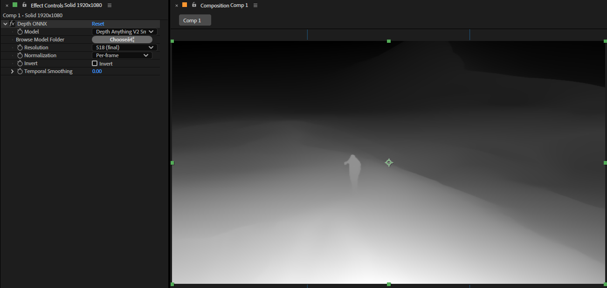

# Depth ONNX

[日本語](./README.ja.md) | [English](./README.md)



Depth ONNX is an Adobe After Effects SmartFX plug-in that runs monocular depth estimation through ONNX Runtime.

ONNX model packs are not bundled. Place folders that contain `manifest.json` and `.onnx` files under the `models/` directory described below. This repository ships a sample manifest for [Depth Anything V2 Small](https://huggingface.co/depth-anything/Depth-Anything-V2-Small-hf) at `model/depth_anything_v2_small/manifest.json`.

> Specifications, UI, parameter names, and defaults may change in future versions.

## Name

- Display name: `Depth ONNX`
- After Effects match name: `ANTH DepthONNX`
- Plugin file name:
  - Windows: `DepthONNX.aex`
  - macOS: `DepthONNX.plugin`

## Main Features

- Monocular depth inference via ONNX Runtime (DirectML on Windows, CPU on macOS)
- Generic model packs driven by `manifest.json` (not limited to Depth Anything)
- Resolution presets 266 / 392 / 518 (depends on pack `variants`)
- Per-frame normalization, invert, and temporal smoothing
- Optional model root via Browse Model Folder
- After Effects Smart Render support

## Validation Status

- Tested on Adobe After Effects 2025 / 2026 / Windows
- End-to-end validation with Depth Anything V2 Small (exported ONNX)
- macOS build recipes are included; on-machine validation is not documented here
- No automated tests ship with this repository

## Build

### Windows

Requires Visual Studio 2022 (MSVC), Rust, optional `just`, and the ONNX Runtime GPU package under `third_party/onnxruntime-win-x64-gpu-*`.

`just release` may fail because `AdobePlugin.just` points `AESDK_ROOT` at a non-existent `sdk/AfterEffectsSDK`. The reliable flow is:

```powershell
cd crates\depth-onnx-ae
Remove-Item Env:AESDK_ROOT -ErrorAction SilentlyContinue
$env:CARGO_TARGET_DIR = "..\..\target"
cargo build --release
Copy-Item -Force ..\..\target\release\depthonnxae.dll ..\..\target\release\DepthONNX.aex
Copy-Item -Force ..\..\third_party\onnxruntime-win-x64-gpu-1.24.4\lib\*.dll ..\..\target\release\
```

Output:

```text
target\release\DepthONNX.aex
target\release\onnxruntime.dll
target\release\onnxruntime_providers_shared.dll
```

To build against a live AE SDK with bindgen, set `AESDK_ROOT` to your SDK root before `cargo build`.

### macOS

```bash
cd crates/depth-onnx-ae
export CARGO_TARGET_DIR=../../target
# export AESDK_ROOT=/path/to/AfterEffectsSDK  # optional; vendored bindings used when unset
just release-bundle
```

Place `third_party/onnxruntime-osx-arm64/lib/libonnxruntime.1.24.4.dylib` before running `release-bundle` (the `post-bundle` step copies it into `Contents/Frameworks/`).

## Installation

### Windows (MediaCore)

Close After Effects, then run PowerShell as administrator:

```powershell
$dst = "C:\Program Files\Adobe\Common\Plug-ins\7.0\MediaCore"
$repo = (Get-Location).Path

Copy-Item -Force "$repo\target\release\DepthONNX.aex" $dst
Copy-Item -Force "$repo\target\release\onnxruntime.dll" $dst
Copy-Item -Force "$repo\target\release\onnxruntime_providers_shared.dll" $dst

$models = "$dst\models\depth_anything_v2_small"
New-Item -ItemType Directory -Force -Path $models | Out-Null
Copy-Item -Force "$repo\model\depth_anything_v2_small\*" $models
```

Destination:

```text
C:\Program Files\Adobe\Common\Plug-ins\7.0\MediaCore\
  DepthONNX.aex
  onnxruntime.dll
  onnxruntime_providers_shared.dll
  models\<pack>\
    manifest.json
    *.onnx
```

Restart After Effects and apply the effect from `Effects > Depth > Depth ONNX`.

Helper script: [`scripts/install_dev.bat`](scripts/install_dev.bat) targets `Effects\DepthONNX\`. For MediaCore installs, prefer the copy steps above.

### macOS

```bash
./scripts/install_dev.sh
```

Destination:

```text
/Library/Application Support/Adobe/Common/Plug-ins/7.0/MediaCore/
  DepthONNX.plugin
  DepthONNX/models/<pack>/
    manifest.json
    *.onnx
```

Generated `.aex` / `.plugin` / `.dll` artifacts are not committed to Git.

## Models

ONNX weights are not in the repository (`.gitignore`). Generate them with the export script:

```bash
pip install -r scripts/requirements.txt
pip install onnxscript

python scripts/export_onnx.py --static-shape --size 518 --out model/depth_anything_v2_small/depth_anything_v2_small.onnx
python scripts/export_onnx.py --static-shape --size 266 --out model/depth_anything_v2_small/depth_anything_v2_small_266.onnx
python scripts/export_onnx.py --static-shape --size 392 --out model/depth_anything_v2_small/depth_anything_v2_small_392.onnx
```

Weights are downloaded from [Hugging Face: Depth-Anything-V2-Small-hf](https://huggingface.co/depth-anything/Depth-Anything-V2-Small-hf) on first export (cache: `~/.cache/huggingface/`).

See [`model/README.md`](model/README.md) for pack layout.

## Parameters

- `Model`: select a scanned model pack
- `Browse Model Folder`: pick an extra model root (`Choose…`)
- `Resolution`: `266 (preview)` / `392 (preview HQ)` / `518 (final)`
- `Normalization`: `Per-frame` / `Fixed range`
- `Invert`: invert the depth output
- `Temporal Smoothing`: exponential smoothing over time (0.00–0.95)

## Development Checks

```powershell
cargo fmt
cargo check
cargo build --release
```

```bash
# macOS
cd crates/depth-onnx-ae && just release-bundle
```

## Environment Variables

| Variable | Purpose |
|----------|---------|
| `AESDK_ROOT` | AE SDK root for bindgen builds |
| `CARGO_TARGET_DIR` | Cargo output directory (default: `target/`) |
| `ORT_DYLIB_PATH` | Explicit ONNX Runtime library path (dev) |
| `AE_DEPTH_ONNX_MODEL_DIR` | Extra model scan root |
| `AE_DEPTHANYTHING_MODEL_DIR` | Legacy alias of the above |

## Limitations

- Each model pack must match its `manifest.json` IO names and preprocess mode
- Windows: `onnxruntime.dll` must sit next to `DepthONNX.aex`
- macOS: ORT dylib is bundled under `Contents/Frameworks/` via `release-bundle`
- Depth inference is expensive; choose resolution / preview presets carefully
- No automated tests yet

## License

- Plug-in: MIT License. See [LICENSE](LICENSE).
- Depth Anything V2: Apache-2.0 (obtain separately)
- ONNX Runtime / AE SDK: follow their respective licenses
